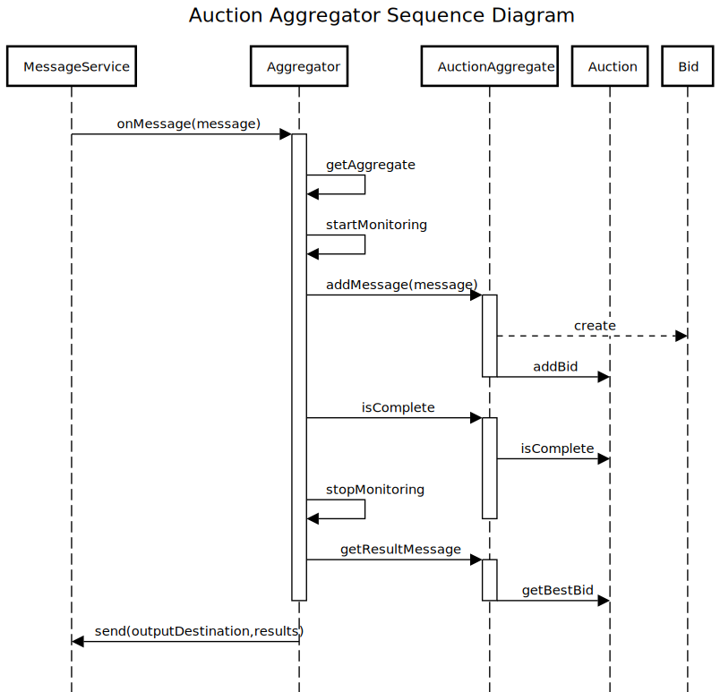

# Aggregator

This example shows the implementation of an _`Aggregator`_. The _`Aggregator`_ receives bid messages on one channel, aggregates all realted bids, and publishes a message with the highest bid to another channel. Bids are correlated through an Auction ID property that acts as a _Corelation identifier_ for the messages.

The aggregation strategy used is _`Timeout with override`_ (wait for a specificed amount of time or until a message with a preset minimu score has been received).

The strategy is to receive a minimum of three bids. The _`Aggregator`_ is self-starting and does not require external initialization.

When an _`Aggregator`_ TTL expires, the auction is considered completed and the _`Aggregator`_ will pick the best rusult for the expired correlationId.

<p align="center">
    <h1 align="center"><b>Auction Aggregator - <i>Timeout with override strategy</i></b></h1>
    <p align="center">
        
    </p>
    <br />
    <br />
</p>

## Installation

If you do not have `corepack` installed locally you can use `npm` or `yarn` to install `pnpm`:

```sh
npm install pnpm -g
# or
yarn install pnpm -g
```

## How to run it

1. Clone the repo
2. Install the dependencies

```sh
pnpm i
```

3. Run the aggregator

```sh
pnpm aggregator
```
